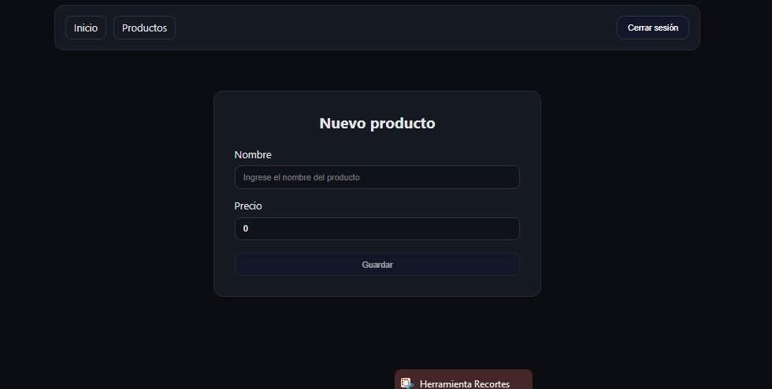
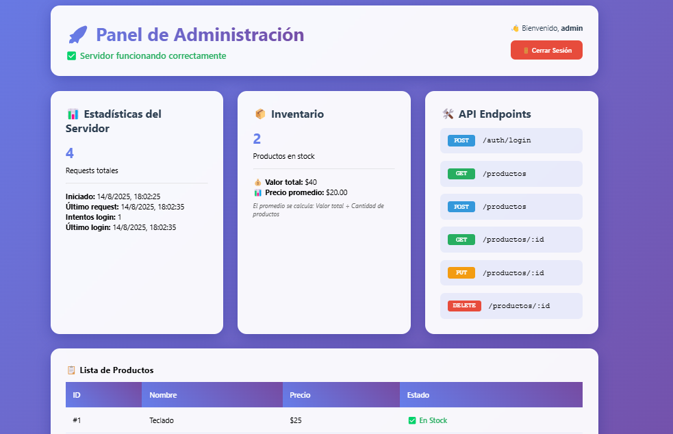

# TFINAL - Proyecto Fullstack

Este proyecto incluye un **backend** en Node.js + Express y un **frontend** en React para la gestión de productos y un panel de administración protegido.

---
## Vista general

### Frontend


### Backend



## Requisitos

- Node.js 18+ y npm
- (Opcional) [Postman](https://www.postman.com/) o similar para probar la API

---

## Estructura del proyecto

```
JOSUE/
│
├── tfinal-backend/           # Backend Express
│   └── server.js
│
└── TFINAL_Frontend_React/    # Frontend React
    └── src/
```

---

## 1. Instalación

### Backend

1. Abre una terminal y navega a la carpeta del backend:
    ```sh
    cd tfinal-backend
    ```
2. Instala las dependencias:
    ```sh
    npm install
    ```
3. Instala la dependencia para el inicio de sesion para el lado del backend
    ```sh
    npm install
    ```
### Frontend

1. Abre otra terminal y navega a la carpeta del frontend:
    ```sh
    cd TFINAL_Frontend_React
    ```
2. Instala las dependencias:
    ```sh
    npm install
    ```

---

## 2. Ejecución

### Backend

1. Desde la carpeta `tfinal-backend`, ejecuta:
    ```sh
    node server.js
    ```
2. El backend estará disponible en:  
   [http://localhost:3000](http://localhost:3000)

   - **Panel de administración:**  
     [http://localhost:3000/login](http://localhost:3000/login)
     - Usuario: `admin`
     - Contraseña: `admin123`

   - **API pública:**  
     - `GET /productos`
     - `POST /productos`
     - `GET /productos/:id`
     - `PUT /productos/:id`
     - `DELETE /productos/:id`
     - `POST /auth/login`

### Frontend

1. Desde la carpeta `TFINAL_Frontend_React`, ejecuta:
    ```sh
    npm run dev
    ```
2. El frontend estará disponible en:  
   [http://localhost:5173](http://localhost:5173)

---

## 3. Uso

### Panel de administración (backend)

- Accede a [http://localhost:3000/login](http://localhost:3000/login)
- Ingresa las credenciales de demo:
  - **Usuario:** `admin`
  - **Contraseña:** `admin123`
- Desde el panel puedes ver estadísticas y la lista de productos.

### Frontend React

- Accede a [http://localhost:5173](http://localhost:5173)
- Inicia sesión con:
  - **Correo:** `admin@demo.com`
  - **Contraseña:** `admin`
- Gestiona productos desde la interfaz amigable.

---

## 4. Notas técnicas

- El backend guarda los productos en memoria (no hay base de datos).
- El panel de administración del backend y el login del frontend son independientes.
- Puedes probar los endpoints de la API con Postman o similar.
- Si ves `"Cannot GET /"` en el backend, accede a `/login` o `/productos`.

---

## 5. Scripts útiles

### Backend

- Instalar dependencias: `npm install`
- Iniciar servidor: `node server.js`

### Frontend

- Instalar dependencias: `npm install`
- Iniciar en modo desarrollo: `npm run dev`

---

## 6. Troubleshooting

- Si algún paquete falta, ejecuta `npm install` en la carpeta correspondiente.
- Si un puerto está ocupado, puedes cambiarlo en el código fuente (`server.js` o configuración de Vite).
- Si los inputs del login sobresalen, revisa los estilos CSS y asegúrate de que tengan `width: 100%` y `box-sizing: border-box`.

---

¡Listo! Ya puedes trabajar y probar tu proyecto fullstack